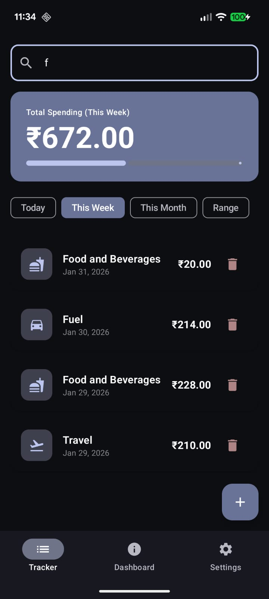
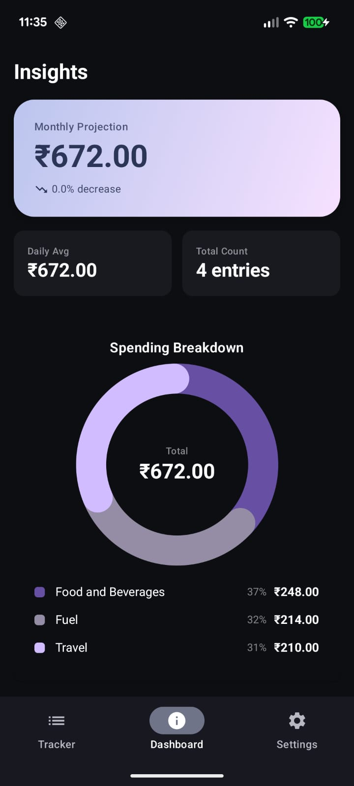
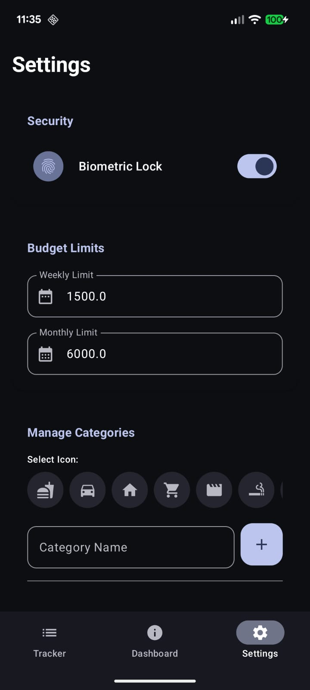
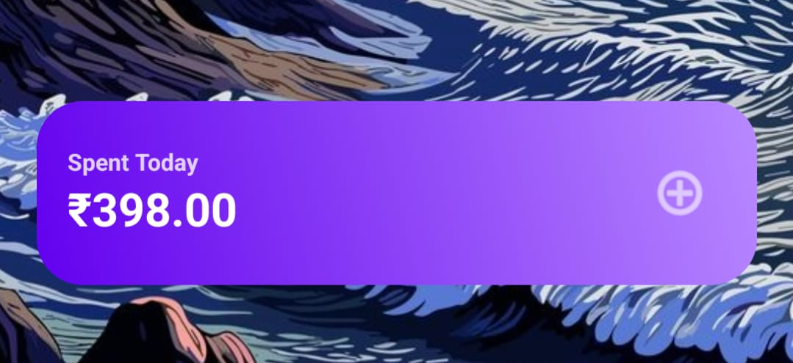

# Expense Pro 💰

A premium, privacy-focused personal finance tracker built with modern Android technologies. Expense Pro offers a beautiful Material 3 interface, biometric security, and real-time analytics without ads or cloud dependency.

## ✨ Key Features

* **Premium Dashboard:**
    * **Dynamic Theming:** Adapts to the user's wallpaper (Material You) while maintaining high-contrast data visualization.
    * **Visual Analytics:** Custom Donut Charts and Gradient Cards for monthly projections.
    * **Smart Insights:** Automatically calculates daily averages and month-over-month spending trends.

* **Widgets & Quick Access:**
    * **Home Screen Widget:** View "Spent Today" instantly and launch a Quick Add dialog directly from the home screen.
    * **Immediate Sync:** Widget updates in real-time as data changes.

* **Security & Privacy:**
    * **Biometric Lock:** Secure your financial data with Fingerprint/Face Unlock.
    * **Offline First:** 100% local data storage using Room Database. No internet required.

* **Data Management:**
    * **CSV Export:** Generate detailed reports for Excel/Sheets.
    * **Category Manager:** Create custom categories with a built-in icon picker.
    * **Edit/Delete:** Full control over transaction history with a forgiving UI.

## 🛠️ Tech Stack

* **Language:** [Kotlin](https://kotlinlang.org/)
* **UI Toolkit:** [Jetpack Compose](https://developer.android.com/jetpack/compose) (Material Design 3)
* **Architecture:** MVVM (Model-View-ViewModel)
* **Local Database:** [Room](https://developer.android.com/training/data-storage/room) (SQLite)
* **Concurrency:** Coroutines & Flow
* **Security:** Android Biometric API
* **System Integration:** App Widgets (RemoteViews), FileProvider (CSV Export)

## 📸 Screenshots

| Dashboard | Add Expense | Settings | Widget |
|:---:|:---:|:---:|:---:|
|  |  |  |  |
## 🚀 Installation

1.  Clone the repository:
    ```bash
    git clone [https://github.com/yourusername/ExpensePro.git](https://github.com/yourusername/ExpensePro.git)
    ```
2.  Open in **Android Studio**.
3.  Sync Gradle files.
4.  Run on an Emulator (API 26+) or Physical Device.

